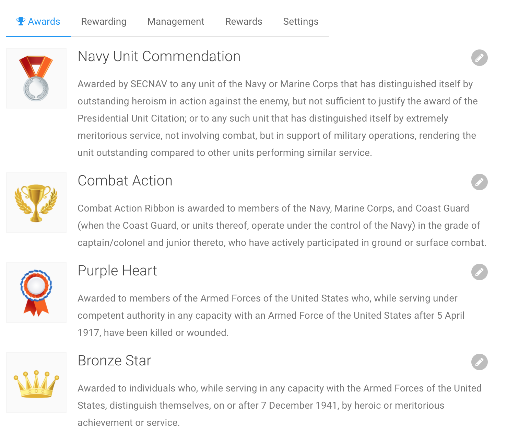
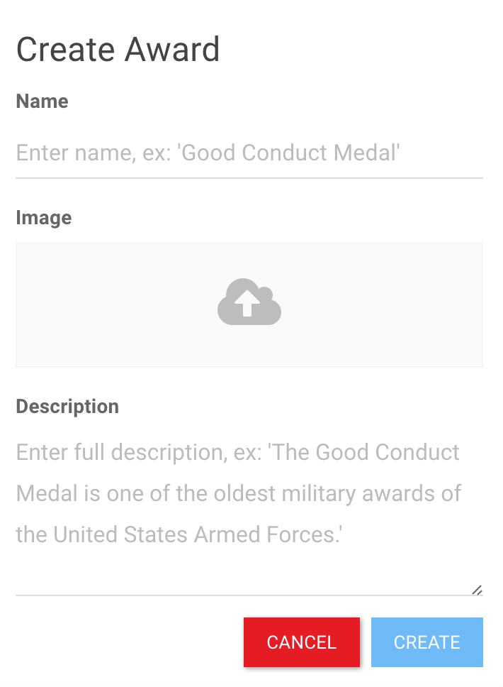
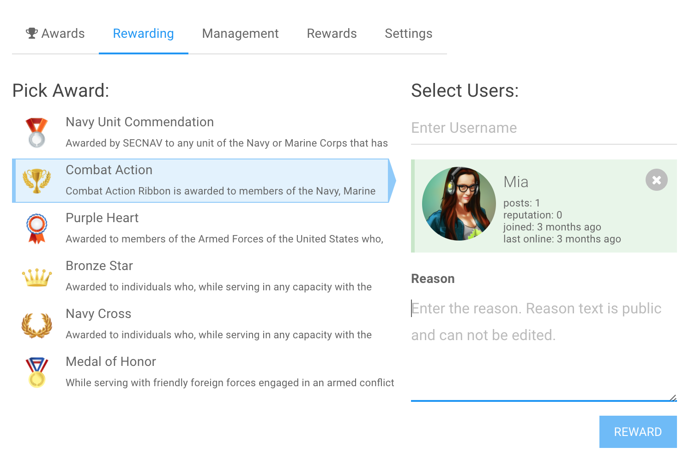
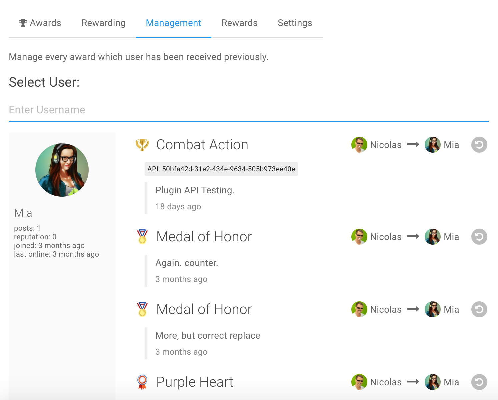
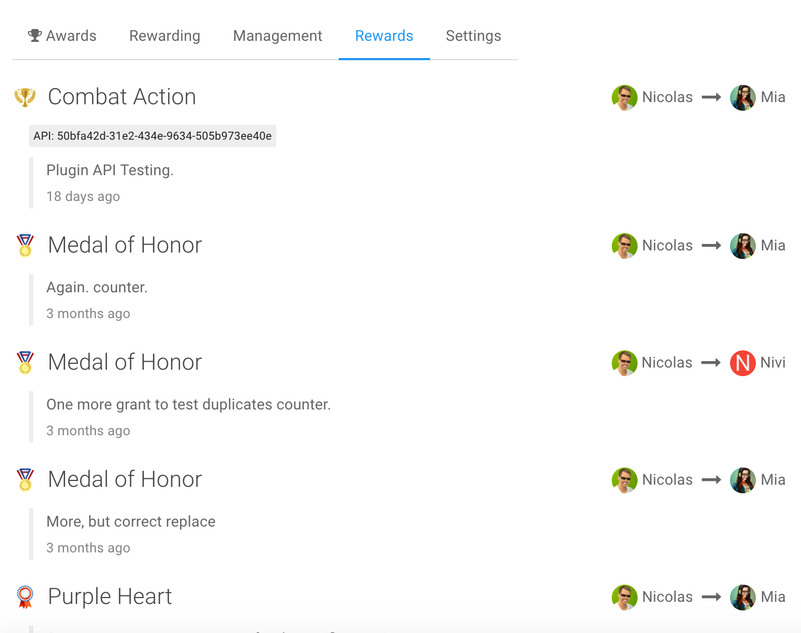
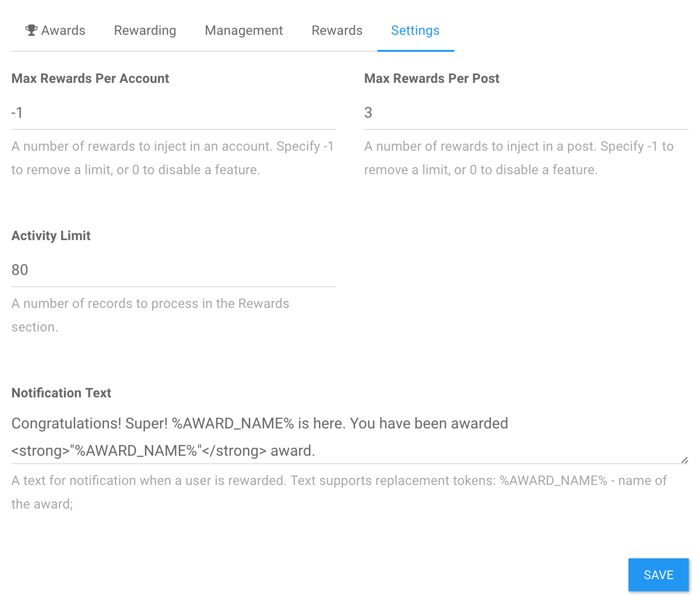

# NodeBB Awards

A system for rewarding forum users. The plugin allows admin to define set of awards that could be granted to users for special accomplishments.


[](https://www.bithound.io/github/NicolasSiver/nodebb-plugin-ns-awards)


<!-- START doctoc generated TOC please keep comment here to allow auto update -->
<!-- DON'T EDIT THIS SECTION, INSTEAD RE-RUN doctoc TO UPDATE -->
 

- [How does it work?](#how-does-it-work)
- [Screenshots](#screenshots)
  - [Awards Overview](#awards-overview)
  - [Create New Award](#create-new-award)
  - [Give an Award](#give-an-award)
  - [User's Rewards Overview](#users-rewards-overview)
  - [Logging](#logging)
  - [Settings](#settings)
- [Themes](#themes)
  - [Profile template](#profile-template)
  - [Topic template](#topic-template)
- [Filters](#filters)
- [Styling](#styling)
  - [Overview Page](#overview-page)
  - [Profile View](#profile-view)
  - [Topic View](#topic-view)
- [API](#api)
  - [`filter:ns.awards.getAwards`](#filternsawardsgetawards)
  - [`static:ns.awards.rewardUser`](#staticnsawardsrewarduser)

<!-- END doctoc generated TOC please keep comment here to allow auto update -->

## How does it work?

Plugin introduces a new entity for your board: `Award`. It could be anything: ribbon, medal, special rank, etc.

1. Visit `Awards` control panel in Admin Control Panel
2. Create several awards, don't forget images.
3. Reward users.
4. If you want to list users' awards, you can augment `Account` or `Post` page templates.

## Screenshots

### Awards Overview



### Create New Award



### Give an Award

You can give reward to the multiple users simultaneously.



### User's Rewards Overview



### Logging



### Settings

If you will scroll further, you can find API Token settings.



## Themes

### Profile template

Use flex template - `awards_profile_flex.tpl` for Persona v4. Place it wherever you like.

```html
<!-- IMPORT partials/awards_profile_flex.tpl -->
```
    
### Topic template

Use topic partial to show awards for every post. Award's metadata is the same as for Profile template.

Example Persona Theme, edit `node_modules/nodebb-theme-persona/templates/partials/topic/post.tpl`:

    <!-- IMPORT partials/awards_topic.tpl -->

## Filters

The plugin injects rewards to the several places. It could be useful for theme enthusiasts. 
It's possible to configure a limit or disable a feature in the settings.

- Posts. Every post will have a new property `nsRewards` with a list of rewards.
- Account. Every account will have a new property `nsRewards` with a list of rewards.

## Styling

### Overview Page

The overview page is based on Flexbox with simple CSS class name set. 
Also, all layout is based on em values.

Key CSS Classes:

- `ns-awards-overview__item`, container for the list item
- `ns-awards-overview__image`, since award image is responsive, it's possible to adjust a width of image container
- `ns-awards-overview__users`, list of the awarded users

### Profile View

Account/Profile page can include awards. 

Key CSS Classes:

- `ns-awards-profile`, container, uses Flexbox
- `ns-awards-profile__image`, image representation of the award

### Topic View

Every post in the topic view can include awards.

Key CSS Classes:

- `ns-awards-topic`, container, uses Flexbox
- `ns-awards-topic__item`, holder for the award
- `ns-awards-topic__image`, image representation of the award

## API

The plugin provides external API via hooks.
All API methods accept single object as a parameter.
Every API request should be authenticated with a token. Tokens could be generated in the ACP.

Example of the request to get all available awards:

```
{
    auth: {
        token: '50bfa42d-31e2-434e-9634-505b973ee40e'
    }
}
```

### `filter:ns.awards.getAwards`

Get all available awards.

Parameters:

- `{Object} payload`
- `{Object} payload.auth` - Authentication 
- `{String} payload.auth.token` - Authentication String

Returns:

- `{Object} result`
- `{Array} result.awards`, returns the list of Award objects

### `static:ns.awards.rewardUser`

Give an award to the user. It's important to specify who will grant the award.

Parameters:

- `{Object} payload`
- `{Number} awardId` - Award Id
- `{Number} fromUserId` - User Id who is giving the award
- `{Number} toUserId` - User Id who is receiving the award
- `{String} reason` - The message to explain why award was given
- `{Object} payload.auth` - Authentication 
- `{String} payload.auth.token` - Authentication String
